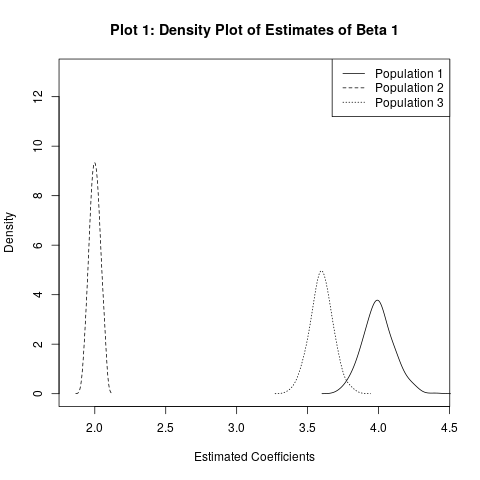

## First Problem: (Simulation: Latent Variable, Probit Model):
$$
\begin{array} { l } 
{ \text { Consider the following JOINT distributions of random variables } X _ { 0 }  \&  \varepsilon _ { j } ^ { * } \text { (You must simulate } } \\ { \text { it as a joint (multivariate) normal distributions!). } } 
\end{array}
$$
$$
\left( 
\begin{array} { c } 
{ X _ { 0 } } \\ { \varepsilon _ { 1 } ^ { * } } \end{array} \right) \sim N \left[ \left( \begin{array} { c } { 10 } \\ { 0 } \end{array} \right) , \left( \begin{array} { c c } { 2 ^ { 2 } } & { 0 } \\ { 0 } & { 1 } \end{array} \right) \right] , \left( \begin{array} { c } { X _ { 0 } } \\ { \varepsilon _ { 2 } ^ { * } } \end{array} \right) \sim N \left[ \left( \begin{array} { c } { 10 } \\ { 0 } \end{array} \right) , \left( \begin{array} { c c } { 2 ^ { 2 } } & { 0 } \\ { 0 } & { 2 ^ { 2 } } \end{array} \right) \right] , \left( \begin{array} { c } { X _ { 0 } } \\ { \varepsilon _ { 3 } ^ { * } } \end{array} \right) \sim N \left[ \left( \begin{array} { c } { 10 } \\ { 0 } \end{array} \right) , \left( \begin{array} { c c } { 2 ^ { 2 } } & { 3 } \\ { 3 } & { 2 ^ { 2 } } \end{array} 
\right) \right]
$$

with 

$$
\begin{array} { l } 
{ \beta _ { 0 } = - 30 } \\ { \beta _ { 1 } = 4 } \\
\\
{ Y _ { j } ^ { * } = \beta _ { 0 } + \beta _ { 1 } * X _ { 1 } + \varepsilon _ { j }} \\
\\
Y _ { j } = \left\{ \begin{array} { l l } { 1 \text { if } Y _ { j } ^ { * } > 0 } \\ { 0 , \text { otherwise } } \end{array} \right.\\
\\
j \in \{ 1,2,3 \}
\end{array}
$$

> a) [1P] Please simulate the three datasets (i.e.: $Y _ { j } , X _ { 1 } , 
\varepsilon _ { j } ^ { * } ; j \in \{ 1,2,3 \}$ ) with a sample size of 30000 observations.
For each of the three datasets, estimate a probit model of $\mathrm { Y } _ { \text { i } } \text { on } x _ { 1 }$ 
and save the estimate for $\hat { \beta } _ { 1 }$.

```{r include=FALSE}
library(tidyverse, quietly = TRUE) # for pipe operator %>%
library(mvtnorm, quietly = TRUE) # for joint multivariate Distribution
library(mfx, quietly = TRUE) # for estimating AMPE

setwd("~/Desktop/Master_Statistik/WS-18-19/Courses/Microeconometrics/Tutorial/1assigment")
```


```{r, echo=FALSE}
# Assigment 1 ------------------------------------------------------------------

# clear environment
rm(list = ls())

# set seed for comparibility
set.seed(101)
# ------------------------------------------------------------------------------
## Define Parameters for the latent model
beta0 <- -30
beta1 <- 4
# Number of Observations 30.000 (use 400 for fast results)
obs = 30000

# Simulate given Distributions -------------------------------------------------

# Use package mvnorm for simulating multivariate Data with given vetcor of means
# and given Covariance Matrix V
# method used described by Ripley (1987, p.98)

## Define Covariance Matrix V for Population j = 1,2,3
V1 <- matrix(c(4,0,0,1), nrow=2, ncol=2)
V2 <- matrix(c(4,0,0,4), nrow=2, ncol=2)
V3 <- matrix(c(4,3,3,4), nrow=2, ncol=2)

# 1.a) Simulate three Datasets with Y, xNull and error -------------------

## Simulate distributions with given means and Covariance; round xNull 
distr1 <- rmvnorm(obs, mean = c(10,0) ,sigma = V1 , method = 'eigen') %>% as.data.frame() 
names(distr1) = c('xNull','error1')
distr1$xNull <- round(distr1$xNull,2)
distr2 <- rmvnorm(obs, mean = c(10,0) ,sigma = V2 , method = 'eigen') %>% as.data.frame()
names(distr2) = c('xNull','error2')
distr2$xNull <- round(distr2$xNull,2)
distr3 <- rmvnorm(obs, mean = c(10,0) ,sigma = V3 , method = 'eigen') %>% as.data.frame()
names(distr3) = c('xNull','error3')
distr3$xNull <- round(distr3$xNull,2)

# Latent Model for the joint multivariate Distributions
yLatent1 <- beta0 + beta1 * distr1[,"xNull"] + distr1[,"error1"]
yLatent2 <- beta0 + beta1 * distr2[,"xNull"] + distr2[,"error2"]
yLatent3 <- beta0 + beta1 * distr3[,"xNull"] + distr3[,"error3"]
## transform Latent Variable into Bernoulli Variable
y1 <- yLatent1 %>% replace(yLatent1<=0,0) %>% replace(yLatent1>0,1)
y2 <- yLatent2 %>% replace(yLatent2<=0,0) %>% replace(yLatent2>0,1)
y3 <- yLatent3 %>% replace(yLatent3<=0,0) %>% replace(yLatent3>0,1)
distr1 <- distr1 %>% mutate(Y = y1)
distr2 <- distr2 %>% mutate(Y = y2)
distr3 <- distr3 %>% mutate(Y = y3)
```

```{r include=FALSE}
# 1.a) Save the estimate for Betaj, j = 1,2,3 -----------------------------

# Probit Model
probit1<-glm(distr1[,"Y"] ~ distr1[,"xNull"], family=binomial(link="probit")) 
probit2<-glm(distr2[,"Y"] ~ distr2[,"xNull"], family=binomial(link="probit")) 
probit3<-glm(distr3[,"Y"] ~ distr3[,"xNull"], family=binomial(link="probit")) 
```

```{r, echo=FALSE}
estBeta1 <- round(probit1$coefficients[2], 2)
estBeta2 <- round(probit2$coefficients[2], 2)
estBeta3 <- round(probit3$coefficients[2], 2)
```

Given our simulated Data, we calculate the Probit model $G ( \cdot )$ to get the Maximum Likelihood estimator $\hat { \beta } _ {j  }$:
$$
\pi = G \left( \mathbf { x } ^ { \prime } \beta \right) = \Phi \left( \mathbf { x } ^ { \prime } \beta \right) = \int _ { - \infty } ^ { \mathbf { x } ^ { * } \beta } \frac { 1 } { \sqrt { 2 \pi } } \exp \left[ - \left( z ^ { 2 } / 2 \right) \right] \mathrm { d } z
$$
The estimates for $\hat { \beta } _ { 1 } , \hat { \beta } _ { 2 } \text{ and } \hat { \beta } _ { 3 }$ are `r estBeta1`, `r estBeta2` and `r estBeta3` respectively.

> b) [1.5P] Repeat a 400 times while saving all the different estimate in vectors for all
three models (based on the three different populations). Plot the kernel density
estimates for $\hat { \beta } _ { 1 }$ based on the three populations next to each other. Describe shortly
the choices you faced and made estimating the density functions.


```{r, echo=FALSE}
# b.) Repeat estimation 400 times -----------------------------------------
## Number of repeated iterations n
n <- 400
# empty vectors for estimated betas for each population
betaEst1 <- NULL
betaEst2 <- NULL
betaEst3 <- NULL
```

```{r include=FALSE}
for (i in 1:n){
  ## Population 1
  distr1 <- rmvnorm(obs, mean = c(10,0) ,sigma = V1 , method = 'eigen') %>% as.data.frame()
  names(distr1) = c('xOne','error1')
  distr1$xOne <- round(distr1$xOne,2)
  yLatent1 <- beta0 + beta1 * distr1[,"xOne"] + distr1[,"error1"]
  y1 <- yLatent1 %>% replace(yLatent1<=0,0) %>% replace(yLatent1>0,1)
  distr1 <- distr1 %>% mutate(Y = y1)
  probit1<-glm(distr1[,"Y"] ~ distr1[,"xOne"], family=binomial(link="probit"))
  betaEst1[i] <- probit1$coefficients[2]
  ## Population 2
  distr2 <- rmvnorm(obs, mean = c(10,0) ,sigma = V2 , method = 'eigen') %>% as.data.frame()
  names(distr2) = c('xOne','error2')
  distr2$xOne <- round(distr2$xOne,2)
  yLatent2 <- beta0 + beta1 * distr2[,"xOne"] + distr2[,"error2"]
  y2 <- yLatent2 %>% replace(yLatent2<=0,0) %>% replace(yLatent2>0,1)
  distr2 <- distr2 %>% mutate(Y = y2)
  probit2<-glm(distr2[,"Y"] ~ distr2[,"xOne"], family=binomial(link="probit"))
  betaEst2[i] <- probit2$coefficients[2]
  ## Population 3
  distr3 <- rmvnorm(obs, mean = c(10,0) ,sigma = V3 , method = 'eigen') %>% as.data.frame()
  names(distr3) = c('xOne','error3')
  distr3$xOne <- round(distr3$xOne,2)
  yLatent3 <- beta0 + beta1 * distr3[,"xOne"] + distr3[,"error3"]
  y3 <- yLatent3 %>% replace(yLatent3<=0,0) %>% replace(yLatent3>0,1)
  distr3 <- distr3 %>% mutate(Y = y3)
  probit3<-glm(distr3[,"Y"] ~ distr3[,"xOne"], family=binomial(link="probit"))
  betaEst3[i] <- probit3$coefficients[2]
}
## Make Plots for the answers
# # Plot the kernel density estimates for beta based on the three populations ----
denBeta1 <- density(betaEst1, bw = "nrd0", adjust = 1, kernel = "gaussian")
denBeta2 <- density(betaEst2, bw = "nrd0", adjust = 1, kernel = "gaussian")
denBeta3 <- density(betaEst3, bw = "nrd0", adjust = 1, kernel = "gaussian")

png(filename="Plot2.png", height = 370)

plot(denBeta1$x,denBeta1$y,type="l",xlim = c(min(betaEst1) ,max(betaEst1)), 
     xlab = "Estimated Coefficient", ylab = "Density", main ="Population 1")
abline(v=mean(betaEst1))
dev.off()


png(filename="Plot1.png")

plot(denBeta1$x,denBeta1$y,type="l",xlim = c(1.85 ,4.4), ylim = c(0, 13),
     xlab = "Estimated Coefficients", ylab = "Density", main ="Density Plot of Estimates")
lines(denBeta2$x,denBeta2$y, lty = 2)
lines(denBeta3$x,denBeta3$y, lty = 3)
legend("topright", legend=c("Population 1", "Population 2", "Population 3"), lty=1:3)
dev.off()

```

```{r, echo=FALSE}

```


Based on our simulation, we estimated 400 random instances of ${\beta } _ { j }$ for each of the three Populations() $Y _ { 1 } , X _ { 1 } , \varepsilon _ { 1 } ^ { * }$ ). To get three smooth Distributions for our estimates we used the kernel density estimator 

$$
\hat { f } _ { h } ( x ) = \frac { 1 } { n } \sum _ { i = 1 } ^ { n } K _ { h } \left( x - x _ { i } \right) = \frac { 1 } { n h } \sum _ { i = 1 } ^ { n } K \left( \frac { x - x _ { i } } { h } \right)
$$
where we choose *K* as a *Gaussian Kernel*, which is the convential choice and produces a standard normal density function. Another option would have been the *Epanechnikov*, which  is optimal in a mean square error sense. Given our Data - which is supoosed to follow a standard normal distribution - the Gaussian Kernel is optimal, though the loss of efficiency is generally small for other Kernels.  In our formular *h* is the smoothing parameter called the bandwidth and had to be choosen accordingly to the data. The goal is to find a bandwidth that is as small as possible to avoid loss of information and represent the approximatly true variance of the estimator. On the other side we want our bandwidth to smoothen the function in a way that we can interprete the true distribution of our estimator. If the bandwith is to small, we will fail to get an interpretable result. A usual rule-of-thumb for the bandwidth is the so called "Silvermann's *rule of thumb*" which is 0.9 times the minimum of the standard deviation and the interquartile range divided by 1.34 times the sample size to the negative one-fifth power (See Silvermann 1987, page 48, eqn (3.31)). It is used as a default for calculating the density in R and produced good result given our data. We also estimated the density plot with a slightly reduced bandwidth, which lead to a unstable distribution picture, especially for population 1. Therefore we remained with the default setting of R.

> i.) $[ 1.5 \mathrm { P } ]$ Now concentrate on the kernel density plot based on the first population (i.e.: $Y _ { 1 } , X _ { 1 } , \varepsilon _ { 1 } ^ { * }$). Does the distribution of $\hat { \beta } _ { 1 }$ conform to your expectations? More specifically, explain which distribution you would expect (and why) and whether the plotted density conform to that expectation (no formal tests necessary).

```{r, echo=FALSE}
knitr::include_graphics('Plot2.png')
```

Given the basic properties of a ML-estimator we expect or estimator $\hat { \boldsymbol { \theta } } _ { N }$ with sample size N to converge in probabilty to the true parameter $\theta$. Therefor we expect $\hat { \boldsymbol { \theta } } _ { N }$ to be a consistent estimator and to be asypmtotically normally distributed with asymptotic variance of $\sqrt { N } \left( \hat { \boldsymbol { \theta } } _ { N } - \boldsymbol { \theta } \right)$. Therefore we expect $\hat { \boldsymbol { \theta } } _ { N }$ to follow
$$
\hat { \boldsymbol { \theta } } _ { N } \sim \operatorname { Normal } ( \boldsymbol { \theta } , \mathbf { V } / N )
$$
The plotted density confirms our expectation by first glance. The estimator is consistent around its expected value of 4, which is equivalent to the true parameter ${ \beta } _ { 1 }$ of our latent model. 

> ii.) $[ 1 \mathrm { P } ]$ Compare the distributions of $\widehat { \beta _ { 1 } }$ from the population j = 1 to the $\widehat { \beta _ { 1 } }$  from the population j = 2 and j = 3, respectively. Why do the means of the distributions differ?

```{r, echo=FALSE}


```

> ii.) $[ 1 \mathrm { P } ]$ Compute the mean of $\widehat { \beta _ { 1 } }$ from the population j = 2. Can you explain, why the distribution of this particular $\widehat { \beta _ { 1 } }$  concentrate approximately around this value?


```{r, echo=FALSE}


```

Simulate again all three populations as you did in a. But this time, estimate and save the average marginal probability effect of $x _ { 1 }$ Repeat the estimation 400 times with a sample size of each iteration equaling 30000 .


```{r, echo=FALSE}


```

> c.) $[ 1 \mathrm { P } ]$ Analogously to b), plot the kernel density estimates for all three AMPE's. Determine the values around which the sample distributions are concentrated.


```{r, echo=FALSE}


```

> i.) $[ 1.5 \mathrm { P } ]$ Calculate the relative difference (in percent) between $\hat { E } [ A M P E | j = 1 ]$ and $\hat { E } [ A M P E | j = 3 ]$. Which estimate would you use to ascertain the effect of the variable $x _ { 1 }$? 


```{r, echo=FALSE}


```

> ii.) $[ 1.5 \mathrm { P } ]$ Calculate the relative difference (in percent) between $\hat { E } [ A M P E | j = 1 ]$ and $\hat { E } [ A M P E | j = 2 ]$. 

```{r, echo=FALSE}


```

> iii.) $[ 1.5 \mathrm { P } ]$  Based on the results in b-ii) would you expect the differences observed in c-i) and  c-ii)? Please provide a detailed explanation for the observed results.


```{r, echo=FALSE}


```

$$
\pagebreak
$$

## Problem 2: (Marginal effects estimation & Interpretation):

Load the dataset “south_african_heart_disease_data.dta” and estimate the effect of ldl-
(bad)cholesterol (ldl) in blood on the probability of suffering from heart disease (chd
equals 1 if one suffers from it).

> a.) $[ 0.5 \mathrm { P } ]$ Can you learn anything from the estimated coefficients? Explain shortly.

```{r, echo=FALSE}


```

> b.) $[ 0.5 \mathrm { P } ]$ Are the S.E. valid, or do you need to adjust them for heteroscedasticity?
Explain.


```{r, echo=FALSE}


```

> c.) $[ 0.5 \mathrm { P } ]$ Re-estimate the model from a) but this time include age in addition to ldl.
You see that the estimated coefficient of ldl changes. Explain why? Additionally,
show that your explanation is supported by the data.

```{r, echo=FALSE}


```

> d.) Finally, estimate the model from a) but include ldl squared next to ldl as a control variable.

```{r, echo=FALSE}


```

> i.) $[ 1 \mathrm { P } ]$ Based on the estimated coefficients from a) and d) draw the two
resulting marginal probability effects of ldl as a function of ldl for ldl $\in$
[1; 15] next to each other.

```{r, echo=FALSE}


```

> ii.) $[ 0.5 \mathrm { P } ]$ Are any of the marginal probability effects linear in ldl? Explain why.

```{r, echo=FALSE}


```

> iii.) $[ 1 \mathrm { P } ]$ What is the advantage of the marginal probability effect based on the
estimation in d) over the one based on a)? Explain shortly.


```{r, echo=FALSE}


```

> iv.) $[ 1.5 \mathrm { P } ]$ Calculate and properly interpret both marginal probability effects for
the mean value of ldl in the sample (You do not need to compute standard
errors).

```{r, echo=FALSE}


```

> iv.) $[ 1 \mathrm { P } ]$ Are any of the effects computed in iv), ceteris paribus effects? Explain
shortly.

