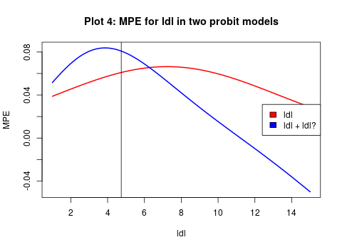

## Microeconometrics 2018/2019 
# Assesment 1

### Group Members: 
Johannes Wagner, ID: 598797, Msc Statistics, <wagnejoh@hu-berlin.de>
Malgorzata Paulina Olesiewicz, ID:598939, Msc Statistics, <malgorzata.paulina.olesiewicz@student.hu-berlin.de>
Kevin Hope, ID: 598247, Msc Statistics, <Kevin.Hoppe1@web.de>                                       

### Division of work: 
```{r, echo = FALSE}
library("kableExtra")
a=c("1.a","1.b","1.b i)","1.b ii)", "1.b iii)","1.c","1.c i)","1.c ii)","1.c iii)","2.a","2.b","2.c","2.d i)","2.d ii)","2.d iii)","2.d iv)","2.d v)")
b=c("100% programming + 80% theory","100% programming + 70% theory","100% programming + 40% theory", "50% theory","100% theory","100% programming","40% theory","90% theory","50% theory","-","-","50% theory","-","30% theory","-","30% theory","30% theory") 
c= c("-", "-","40% theory","50% theory","-", "-","50% theory","- ","50% theory","100% theory + programming ","100% theory","50% theory + 100% programming","-","40% theory","100% theory ","40% theory + 100% programming","40% theory") 
 
d= c("20% theory","30% theory","20% theory","-", "10% theory","-", "10% theory ","-","-","-","-","-", "100% programming ","30% theory","-","30% theory","30% theory")

work = data.frame(a,b,c,d)
colnames(work)= c("Task","Johannes","Malgorzata","Kevin")
kable(work)%>% kable_styling() 
```


$$
\pagebreak
$$

## First Problem: (Simulation: Latent Variable, Probit Model):
$$
\begin{array} { l } 
{ \text { Consider the following JOINT distributions of random variables } X _ { 0 }  \&  \varepsilon _ { j } ^ { * }}
\end{array}
$$
$$
\left( 
\begin{array} { c } 
{ X _ { 0 } } \\ { \varepsilon _ { 1 } ^ { * } } \end{array} \right) \sim N \left[ \left( \begin{array} { c } { 10 } \\ { 0 } \end{array} \right) , \left( \begin{array} { c c } { 2 ^ { 2 } } & { 0 } \\ { 0 } & { 1 } \end{array} \right) \right] , \left( \begin{array} { c } { X _ { 0 } } \\ { \varepsilon _ { 2 } ^ { * } } \end{array} \right) \sim N \left[ \left( \begin{array} { c } { 10 } \\ { 0 } \end{array} \right) , \left( \begin{array} { c c } { 2 ^ { 2 } } & { 0 } \\ { 0 } & { 2 ^ { 2 } } \end{array} \right) \right] , 
$$

$$
\left( 
\begin{array} { c } { X _ { 0 } } \\ { \varepsilon _ { 3 } ^ { * } } \end{array} \right) \sim N \left[ \left( \begin{array} { c } { 10 } \\ { 0 } \end{array} \right) , \left( \begin{array} { c c } { 2 ^ { 2 } } & { 3 } \\ { 3 } & { 2 ^ { 2 } } \end{array} 
\right) \right]
$$

with 

$$
\begin{array} { l } 
{ \beta _ { 0 } = - 30 } \\ { \beta _ { 1 } = 4 } \\
\\
{ Y _ { j } ^ { * } = \beta _ { 0 } + \beta _ { 1 } * X _ { 1 } + \varepsilon _ { j }} \\
\\
Y _ { j } = \left\{ \begin{array} { l l } { 1 \text { if } Y _ { j } ^ { * } > 0 } \\ { 0 , \text { otherwise } } \end{array} \right.\\
\\
j \in \{ 1,2,3 \}
\end{array}
$$

## a) [1P] 

```{r include=FALSE}
library(tidyverse, quietly = TRUE) # for pipe operator %>%
library(mvtnorm, quietly = TRUE) # for joint multivariate Distribution
library(mfx, quietly = TRUE) # for estimating AMPE
library(foreign, quietly = TRUE)
library(margins, quietly = TRUE)
library(texreg, quietly = TRUE) # for printing the probit model
```


```{r, echo=FALSE}
# Assigment 1 ------------------------------------------------------------------
# Define Directory
dir <- "~/R/git/Micro_Ass1/Markdown"

setwd(dir)
# clear environment
rm(list = ls())

# set seed for comparibility
set.seed(101)
# ------------------------------------------------------------------------------
## Define Parameters for the latent model
beta0 <- -30
beta1 <- 4
# Number of Observations 30.000
obs = 30000

# Simulate given Distributions -------------------------------------------------

# Use package mvnorm for simulating multivariate Data with given vetcor of means
# and given Covariance Matrix V
# method used described by Ripley (1987, p.98)

## Define Covariance Matrix V for Population j = 1,2,3
V1 <- matrix(c(4,0,0,1), nrow=2, ncol=2)
V2 <- matrix(c(4,0,0,4), nrow=2, ncol=2)
V3 <- matrix(c(4,3,3,4), nrow=2, ncol=2)

# 1.a) Simulate three Datasets with Y, xNull and error -------------------

## Simulate distributions with given means and Covariance; round xNull 
distr1 <- rmvnorm(obs, mean = c(10,0) ,sigma = V1 , method = 'eigen') %>% as.data.frame() 
names(distr1) = c('xNull','error1')
distr1$xNull <- round(distr1$xNull,2)
distr2 <- rmvnorm(obs, mean = c(10,0) ,sigma = V2 , method = 'eigen') %>% as.data.frame()
names(distr2) = c('xNull','error2')
distr2$xNull <- round(distr2$xNull,2)
distr3 <- rmvnorm(obs, mean = c(10,0) ,sigma = V3 , method = 'eigen') %>% as.data.frame()
names(distr3) = c('xNull','error3')
distr3$xNull <- round(distr3$xNull,2)

# Latent Model for the joint multivariate Distributions
yLatent1 <- beta0 + beta1 * distr1[,"xNull"] + distr1[,"error1"]
yLatent2 <- beta0 + beta1 * distr2[,"xNull"] + distr2[,"error2"]
yLatent3 <- beta0 + beta1 * distr3[,"xNull"] + distr3[,"error3"]
## transform Latent Variable into Bernoulli Variable
y1 <- yLatent1 %>% replace(yLatent1<=0,0) %>% replace(yLatent1>0,1)
y2 <- yLatent2 %>% replace(yLatent2<=0,0) %>% replace(yLatent2>0,1)
y3 <- yLatent3 %>% replace(yLatent3<=0,0) %>% replace(yLatent3>0,1)
distr1 <- distr1 %>% mutate(Y = y1)
distr2 <- distr2 %>% mutate(Y = y2)
distr3 <- distr3 %>% mutate(Y = y3)
```

```{r include=FALSE}
# 1.a) Save the estimate for Betaj, j = 1,2,3 -----------------------------

# Probit Model
probit1<-glm(distr1[,"Y"] ~ distr1[,"xNull"], family=binomial(link="probit")) 
probit2<-glm(distr2[,"Y"] ~ distr2[,"xNull"], family=binomial(link="probit")) 
probit3<-glm(distr3[,"Y"] ~ distr3[,"xNull"], family=binomial(link="probit")) 
```

```{r, echo=FALSE}
estBeta1 <- round(probit1$coefficients[2], 2)
estBeta2 <- round(probit2$coefficients[2], 2)
estBeta3 <- round(probit3$coefficients[2], 2)
```

Given our simulated Data of independent samples, the parameter estimate in the respective Probit model  $\hat { \beta } _ {1,j  }$ for j = 1,2,3 can be obtained through the maximization of the log likelihood of the probability function for our binary dependend variable $y _ { i }$ given $x _ { 1 }$.

The estimates for $\hat { \beta } _ { 1,1 } , \hat { \beta } _ { 1,2 } \text{ and } \hat { \beta } _ { 1,3 }$ are `r estBeta1`, `r estBeta2` and `r estBeta3` respectively.

## b) [1.5P] 

```{r, echo=FALSE}
# b.) Repeat estimation 400 times -----------------------------------------
## Number of repeated iterations n
n <- 400
# empty vectors for estimated betas for each population
betaEst1 <- NULL
betaEst2 <- NULL
betaEst3 <- NULL
```

```{r include=FALSE}
for (i in 1:n){
  ## Population 1
  distr1 <- rmvnorm(obs, mean = c(10,0) ,sigma = V1 , method = 'eigen') %>% as.data.frame()
  names(distr1) = c('xOne','error1')
  distr1$xOne <- round(distr1$xOne,2)
  yLatent1 <- beta0 + beta1 * distr1[,"xOne"] + distr1[,"error1"]
  y1 <- yLatent1 %>% replace(yLatent1<=0,0) %>% replace(yLatent1>0,1)
  distr1 <- distr1 %>% mutate(Y = y1)
  probit1<-glm(distr1[,"Y"] ~ distr1[,"xOne"], family=binomial(link="probit"))
  betaEst1[i] <- probit1$coefficients[2]
  ## Population 2
  distr2 <- rmvnorm(obs, mean = c(10,0) ,sigma = V2 , method = 'eigen') %>% as.data.frame()
  names(distr2) = c('xOne','error2')
  distr2$xOne <- round(distr2$xOne,2)
  yLatent2 <- beta0 + beta1 * distr2[,"xOne"] + distr2[,"error2"]
  y2 <- yLatent2 %>% replace(yLatent2<=0,0) %>% replace(yLatent2>0,1)
  distr2 <- distr2 %>% mutate(Y = y2)
  probit2<-glm(distr2[,"Y"] ~ distr2[,"xOne"], family=binomial(link="probit"))
  betaEst2[i] <- probit2$coefficients[2]
  ## Population 3
  distr3 <- rmvnorm(obs, mean = c(10,0) ,sigma = V3 , method = 'eigen') %>% as.data.frame()
  names(distr3) = c('xOne','error3')
  distr3$xOne <- round(distr3$xOne,2)
  yLatent3 <- beta0 + beta1 * distr3[,"xOne"] + distr3[,"error3"]
  y3 <- yLatent3 %>% replace(yLatent3<=0,0) %>% replace(yLatent3>0,1)
  distr3 <- distr3 %>% mutate(Y = y3)
  probit3<-glm(distr3[,"Y"] ~ distr3[,"xOne"], family=binomial(link="probit"))
  betaEst3[i] <- probit3$coefficients[2]
}

## Make Plots for the answers
# Plot the kernel density estimates for beta based on the three populations ----
denBeta1 <- density(betaEst1, bw = "nrd0", adjust = 1.5, kernel = "gaussian")
denBeta2 <- density(betaEst2, bw = "nrd0", adjust = 1.5, kernel = "gaussian")
denBeta3 <- density(betaEst3, bw = "nrd0", adjust = 1.5, kernel = "gaussian")

png(filename="Plot2.png", height = 370)

plot(denBeta1$x,denBeta1$y,type="l",xlim = c(min(betaEst1) ,max(betaEst1)),
     xlab = "Estimated Coefficients of Beta 1", ylab = "Density", main ="Plot 2: Density Plot for Population 1")
rv <- rnorm(n, mean=mean(betaEst1),sd=sd(betaEst1)) %>% sort()
y <- dnorm(rv, mean=mean(betaEst1), sd=sd(betaEst1))
lines(rv, y, col = "indianred1")
abline(v=mean(betaEst1))
dev.off()


png(filename="Plot1.png")

plot(denBeta1$x,denBeta1$y,type="l",xlim = c(1.85 ,4.4), ylim = c(0, 13),
     xlab = "Estimated Coefficients", ylab = "Density", main ="Plot 1: Density Plot of Estimates of Beta 1")
lines(denBeta2$x,denBeta2$y, lty = 2)
lines(denBeta3$x,denBeta3$y, lty = 3)
legend("topright", legend=c("Population 1", "Population 2", "Population 3"), lty=1:3)
dev.off()

```

```{r, echo=FALSE}
knitr::include_graphics('Plot1.png')
```


In order to be able to interprete our distributions, we need to find a smooth representation for the probability density function of our estimates. We can make use of a kernel estimator 

$$
\hat { f } _ { h } ( x ) = \frac { 1 } { n } \sum _ { i = 1 } ^ { n } K _ { h } \left( x - x _ { i } \right) = \frac { 1 } { n h } \sum _ { i = 1 } ^ { n } K \left( \frac { x - x _ { i } } { h } \right)
$$
where we choose *K* to be a *Gaussian Kernel*, which is the convential choice and produces a standard normal density function. That means that $K ( x ) = \phi ( x )$, where $\phi$ is the probability density function of the standard normal. Given that we expect our estimator ${ \beta } _ {1}$ to have approximately normal distribution (see answer b.ii. below), this is the best choice for our kernel density estimation.
The smoothing parameter  *h*  is called the bandwidth and had to be choosen accordingly to the data. The goal is to find a bandwidth that is as small as possible to avoid loss of information and as big as necessary to represent the true density of our estimates.
A rule-of-thumb for the bandwidth in R is "Silvermann's *rule of thumb*" (See man page of function density() in R). It is used as the default for calculating the density in R and can be adjusted trough the multiplication with an adjustment parameter. We can reduce the bandwidth with an adjustment parameter smaller than zero. This resulted in an unstable distribution picture, especially for population 1. Therefore we decided to increase the bindwith by the factor 1.5 to get a stable and informative distribution.

## i.) [1.5P] 

```{r, echo=FALSE}
knitr::include_graphics('Plot2.png')
```

Given the basic properties of a ML-estimator, we expect our estimates of $\hat { \beta } _ {1,j}$ in general to be consistent and asymptotically normally distributed.

Given our relatively large number of samples, we can expect our estimator to asymptotically converge in probability to the true parameter ${ \beta } _ {1}$, given that the assumptions of our probit model are not violated. In our probit model, we assume that the errors of the latent variable model are a.) independend of the explanatory variable $x _ { 1 }$ and b.) follow a standard normal distribution. We know from our parameters for the first population that those assumptions holds.  

The plotted density confirms our expectation. We see that the plotted density of our estimates (black line in Plot 2) approximately follows a normal distribution, which is illustrated with the red line.
The estimates of  $\hat { \beta } _ {1}$ for our first population are concentrated around their expected value of 4, which is equivalent to the true parameter ${ \beta } _ { 1 }$ in our latent model. 

## ii.) [1P] 

As we can see in Plot 1 all 3 distributions are approximatly normal distributed, but differ in their means and variances. For the means of our estimates we find that ${\hat { E }(\hat \beta } _ { 1,1 })$ = `r round(mean(betaEst1),3)`, ${\hat { E }(\hat \beta } _ { 1,2 })$ = `r round(mean(betaEst2),3)` and ${\hat { E }(\hat \beta } _ { 1,3 })$ = `r round(mean(betaEst3),3)`. 

Given the assumptions stated in i), we expect the estimate of ${\hat \beta } _ { 1 }$ in this population to be close to the true value of 4, as it is the case. 
In the second population our errors have a variance greater than 1. This results in a decreased estimate of ${\hat \beta } _ { 1 }$, since the probit estimator is derived as being equal to ${\beta / \sigma}$ with $\sigma$ being the standard deviation of our error term.
In the third population we can additionaly observe a covariance greater than zero between the explanatory variable and the error term in our latent model. Therefore our error term is not independent of the explanatory variable in our latent model as requested by a.) and our estimate of ${\hat \beta } _ { 1 }$ from population j = 3 is inconsistent. In this case it does not make much sense to compare the estimates from population three to the other ones, since the probit estimator can not be derived as being equal to ${\beta / \sigma}$ anymore. 

## iii.) [1P] 

The mean estimate for ${\hat { E }(\hat \beta } _ { 1,2 })$ = `r round(mean(betaEst2),3)`. 

We know that probit of y on x consistently estimates ${\beta / \sigma}$ rather than just $\beta$. When the error term in our latent model is not standard normal distributed, as this is the case in population 2, with a variance of the error term of 4 (or standard deviation of 2), we expect our estimator to be consistently estimated at $\hat { \beta } _ { 1 } = \beta _ { j } / \sigma = 4 / 2 = 2$.  


```{r include=FALSE}
## create empty vectors for our estimates
AMPEEst1 <- NULL
AMPEEst2 <- NULL
AMPEEst3 <- NULL


for (i in 1:n){
  ## Population 1
  distr1 <- rmvnorm(obs, mean = c(10,0) ,sigma = V1 , method = 'eigen') %>% as.data.frame()
  names(distr1) = c('xOne','error1')
  distr1$xOne <- round(distr1$xOne,2)
  yLatent1 <- beta0 + beta1 * distr1[,"xOne"] + distr1[,"error1"]
  y1 <- yLatent1 %>% replace(yLatent1<=0,0) %>% replace(yLatent1>0,1)
  distr1 <- distr1 %>% mutate(Y = y1)
  probitAMPE1 <- probitmfx(Y~xOne,data=distr1,atmean=FALSE)
  AMPEEst1[i] <- probitAMPE1$mfxest[1]
  ## Population 2
  distr2 <- rmvnorm(obs, mean = c(10,0) ,sigma = V2 , method = 'eigen') %>% as.data.frame()
  names(distr2) = c('xOne','error2')
  distr2$xOne <- round(distr2$xOne,2)
  yLatent2 <- beta0 + beta1 * distr2[,"xOne"] + distr2[,"error2"]
  y2 <- yLatent2 %>% replace(yLatent2<=0,0) %>% replace(yLatent2>0,1)
  distr2 <- distr2 %>% mutate(Y = y2)
  probitAMPE2 <- probitmfx(Y~xOne,data=distr2,atmean=FALSE)
  AMPEEst2[i] <- probitAMPE2$mfxest[1]
  ## Population 3
  distr3 <- rmvnorm(obs, mean = c(10,0) ,sigma = V3 , method = 'eigen') %>% as.data.frame()
  names(distr3) = c('xOne','error3')
  distr3$xOne <- round(distr3$xOne,2)
  yLatent3 <- beta0 + beta1 * distr3[,"xOne"] + distr3[,"error3"]
  y3 <- yLatent3 %>% replace(yLatent3<=0,0) %>% replace(yLatent3>0,1)
  distr3 <- distr3 %>% mutate(Y = y3)
  probitAMPE3 <- probitmfx(Y~xOne,data=distr3,atmean=FALSE)
  AMPEEst3[i] <- probitAMPE3$mfxest[1]
}


# c) Plot the kernel density estimates ------------------------------------

# adjust broder bandwidth to get a smooth function
denAMPE1 <- density(AMPEEst1, bw = "nrd0", adjust = 2, kernel = "gaussian")
denAMPE2 <- density(AMPEEst2, bw = "nrd0", adjust = 2, kernel = "gaussian")
denAMPE3 <- density(AMPEEst3, bw = "nrd0", adjust = 2, kernel = "gaussian")

## Make one Plot
png(filename="Plot3.png")

plot(denAMPE1$x,denAMPE1$y,type="l",xlim = c(min(AMPEEst1),max(AMPEEst3)), ylim = c(0, 300),
     xlab = "Estimated Coefficients", ylab = "Density", main ="Plot 3: Density Plot of AMPES")
lines(denAMPE2$x,denAMPE2$y, lty = 2)
lines(denAMPE3$x,denAMPE3$y, lty = 3)
legend("topright", legend=c("Population 1", "Population 2", "Population 3"), lty=1:3)

clip(0,0.120,0,max(denAMPE1$y))
abline(v=mean(AMPEEst1))
clip(0,0.120,0,max(denAMPE2$y))
abline(v=mean(AMPEEst2))
clip(0,0.120,0,max(denAMPE3$y))
abline(v=mean(AMPEEst3))
dev.off()


```


## c.) [1P]

```{r, echo=FALSE}
knitr::include_graphics('Plot3.png')
```

Again we can see that the sample distributions are approximately normal and concentrated around their means. We get `r round(mean(AMPEEst1),3)`, `r round(mean(AMPEEst2),3)` and  `r round(mean(AMPEEst3),3)` for $\hat { E } [ A M P E | j ]$ given the populations j = 1,2 and 3.


## i.) [1.5P] 


```{r, echo=FALSE}
relDiff1 <- round(abs((mean(AMPEEst1) - mean(AMPEEst3)) / mean(AMPEEst3)*100),2)
```
We calculate the relative difference:
$$
\text{relative difference} = \left| \frac { x - y } { max ( x , y ) } \right|
$$

The relative difference between $\hat { E } [ A M P E | j = 1 ]$ and  $\hat { E } [ A M P E | j = 3 ]$ is `r relDiff1` percent.

In this case, the estimate of $\hat { E } [ A M P E | j = 1 ]$ is more reliable, since in the model for the population 1 we observe  a) the error term to be uncorrelated with the variable $x _ { 1 }$ and b) the standard normality of the error term. Therefore, $\hat { E } [ A M P E | j = 1 ]$ can be estimated consistantly as oppose to $\hat { E } [ A M P E | j = 3 ]$ which is estimated from a model of population 3, which violates both assumptions necessary for assymptotic consistency of our estimator.  

## ii.) [0.5P]

```{r, echo=FALSE}
relDiff2 <- round(abs((mean(AMPEEst1) - mean(AMPEEst2)) / mean(AMPEEst2)*100),2)
```

The relative difference between $\hat { E } [ A M P E | j = 1 ]$ and $\hat { E } [ A M P E | j = 2 ]$ is `r relDiff2` percent.

## iii.) [3P] 

Taking into account that AMPE depends on the value of $\hat { \beta }_1$, the results in c-i) and c-ii) are not intuitive, since in Plot 1 $\hat { \beta }_1$ for population 1 and 3 are much closer to each other than to $\hat { \beta }_1$ for population 2.

However, since we know that in case of population 2 - where the error term does not follow a standard normal, but is still uncorrelated  with ${x_1}$ - the attentuation bias in ${\beta / \sigma}$ will average out across its distribution during the AMPE estimation. Since both our AMPE estimators of poulation j = 1 and j = 2 are consistant, we expect the AMPE estimates to concentrate approximately around the same value and their relative difference to be very small (c-ii). If we look at Plot 3, we see that both distributions are in fact close, with $\hat { E } [ A M P E | j = 2 ]$ being slightly bigger than  $\hat { E } [ A M P E | j = 1 ]$. Since the variance of the error term in population j = 2 is greater than 1, we assume to be dealing with neglected heterogeneity here, which adds an unknown constant to our partial effects in the probit.

In population 3 we also deal with suspected unobserved heterogenity with the variance of the error term being greater than 1. However, here the error term is correlated with ${x_1}$ and the probit is clearly heteroscedastic with regard to the explamatory variable. In this case it is not possible to estimate $\hat { \beta } _ { 1 }$ and $\hat { E } [ A M P E | j = 3 ]$ consistantly. The violation of our model assumptions in the probit and the resulting inconsistance of the estimator explains the relatively big discrepancy between $\hat { E } [ A M P E | j = 1 ]$ and $\hat { E } [ A M P E | j = 3 ]$. This can be observed in Plot 3 and results in the relative big difference calculated in c)i. 


$$
\pagebreak
$$

## Problem 2: (Marginal effects estimation & Interpretation):

## a.) [0.5P] 


```{r, echo=FALSE}
# Define Directory
dir <- "~/R/git/Micro_Ass1"

setwd(dir)

data <- read.dta(file= "south_african_heart_disease_data.dta") 
## Estimating effect ch ~ ldl

probit<-glm(data$chd~data$ldl,family=binomial(link="probit"))

```

In non-linear regression models, such as the probit model, coefficients cannot be interpreted as marginal effects. In probit model, the coefficients could
be interpreted with respect to the latent variable but since it has no specific unit, we cannot use any meaningful scale.
Therefore, the coefficients give only the direction (signs) of the partial effect of each ${x}$ on the response probability, and its statistical significance by giving us the information whether we can reject null hypothesis at sufficiently small significance level. Therefore, ldl-cholesterol increases the probability of suffering from the disease and is significantly different from zero.


## b.) [0.5P] 

The MLE ${ \beta }_1$ is derived from the log-likelihood function, which is a logarithmic transformation of a joint probability density function of the given sample, where the distribution of y depends on x. Because y is a binary (Bernoulli) random variable, the variance depends on $\mathrm { P } \left( y _ { i } = 1 | \mathbf { x } _ { i } \right)$, which in general is a function of ${x}_i$, i.e. y is heteroskedastic. 
Therefore, in the estimation of our coefficient $\hat { \beta }_1$ through the MLE method, the heteroskedasticity in Var(y|x) is automatically accounted for and there is no need to further test for it. The estimated Standard Errors have asymptotic properties and can be used to conduct the asymptotic t-test and confidence intervals. 

## c.) [2P]


```{r, echo=FALSE}
probit2<-glm(data$chd~data$ldl+data$age,family=binomial(link="probit"))

correlation_ldl_age <- cor.test(data$ldl, data$age)
resultCor <-as.numeric(correlation_ldl_age[4]) %>% round(2)
```

In the second model, the coefficients are estimated under the ceteris paribus assumption (all else being equal), meaning that while estimating each of them we control for the effect of all other predictors in the model.
If both variables were independent, the coefficient of *ldl* should not change in the second model when controling for *age*. Therefore, seeing that the coefficient for *ldl* has changed compared to the estimated model without *age*, we may suspect that *ldl* and *age* are not independent. Plausibility check: older people in the sample may tend to have higher levels of cholesterol. Now, let's check for that in the data: Correlation between variables idl and age = `r resultCor`
As expected, *ldl* and *age* are not independent. In the first model, the *ldl* coefficient captured some of the *ldl* variations on *age*. When explicitly entering *age* as a regressor, that part of the variance in *ldl* is removed from the coefficient. 

## d. i.) [1P] 

```{r, echo=FALSE}
probit3<-glm(data$chd~poly(data$ldl,2, raw= TRUE),family=binomial(link="probit"))
```

```{r, echo=FALSE}

## Extract regression coefficients:

beta.1 <- as.numeric(probit$coefficients)
beta.2 <- as.numeric(probit3$coefficients)

## Prepare design matrices:

ldl <- seq(1, 15, 0.01)
ldl.square <- ldl^2
int <- rep(1, length(ldl))

designmat.1 <- as.matrix(data.frame("intercept" = int, 
                                    "ldl" = ldl))

designmat.2 <- as.matrix(data.frame("intercept" = int, 
                                    "ldl" = ldl, 
                                    "ldl.square" = ldl.square))

## Calculate linear predictor:

xb1 <- designmat.1 %*% beta.1
xb2 <- designmat.2 %*% beta.2

## Calculate marginal probability effect for each probit model:

mpe1 <- dnorm(xb1)*beta.1[2]
mpe2 <- dnorm(xb2)*(beta.2[2] + 2*beta.2[3]*ldl)
```

```{r, include=FALSE}
## Plot them together:
png(filename="Plot4.png", height = 350)

plot(x = ldl, 
     y = mpe1, 
     t= "l", 
     col="red", 
     lwd=2, 
     xlim=c(1,15),
     ylim=c(min(mpe1, mpe2), max(mpe1, mpe2)),
     main = "Plot 4: MPE for ldl in two probit models",
     ylab = "MPE")

lines(x = ldl, y = mpe2, t= "l", col="blue", lwd=2)
abline(v=mean(data$ldl))

legend("right", legend = c("ldl", "ldl + ldl²"), fill=c("red", "blue"))
dev.off()
```

```{r, echo=FALSE}

```

## ii.) [0.5P] 

In Probit model, to calculate the MPE we are transforming the linear model of the beta estimators through the pdf (non-linear function) multiplication, which indicates that non of the the MPE is therefore linear. An increase in *ldl* by one unit leads to an incremental change in the probability by $\phi ( \mathbf { x } \boldsymbol { \beta } ) \left( \beta _ { 1 } \right)$.
The value of the MPE with respect to that one regressor therefore depends on the value of all other regressors and is estimated for every observation sperepatly.


## iii.) [1P] 

Adding $ldl^2$ variable allows us to estimate whether the marginal effect of *ldl* on probability increases or decreases according to the value of *ldl*, as oppose to model a) where we assume stricktly monotonic effect of ldl on marginal probability.
In estimation d) the marginal effect of $ldl^2$  has a negative coefficient, which tells us that the marginal popability function of $P(Y=1|ldl)$ is concaved and will reach its maximum when $\frac { d P } { d \operatorname { ldl } }$ is equal to 0.
Interpretation: Until certain level (in our case ~ 11 see plot 4) the increase of *ldl* will increase the chances of the getting the heart disease, however above this level the marginal probility effect of *ldl* in model d.) will become negative. Once the individual reaches certain level of ldl it is very likely they have a heart disease, therefore even further increase of ldl has not a positive impact on probability of getting heart disease anymore.
This interpretation is not possible based on the estimation a), where we can only observed that increase in the *ldl* level increases the probability
of getting the heart disease.

## iv.) [1.5P] 

```{r, echo=FALSE}
mean_ldl= mean(data$ldl)

# calculate MPEs
mpe1_mean <- dnorm(beta.1[1]+ beta.1[2]*mean_ldl)*(beta.1[2])
mpe2_mean <- dnorm(beta.2[1]+ beta.2[2]*mean_ldl+beta.2[3]*mean_ldl^2)*(beta.2[2] + 2*beta.2[3]*mean_ldl)

# get model parameters
Probit_at_ldl_mean1 <- probitmfx(data$chd~data$ldl,data=data,atmean=TRUE)
Probit_at_ldl_mean2 <- probitmfx(data$chd~data$ldl+I(data$ldl^2),data=data,atmean=TRUE)
```
In the model a), $\frac { d P } { d \operatorname { ldl } }$ of *ldl* at mean is equal to `r round(mpe1_mean,4)`.

Interpretation: The marginal probability in the sample suggest that for an individual with the exact mean characteristics
increase of their ldl-cholesterol by one unit, increases their probability of getting the heart disease by 6.09 procentage points.

In the model d), $\frac { d P } { d \operatorname { ldl } }$ of *ldl* at mean is equal to `r round(mpe2_mean,4)`.

Interpretation: For an individual with the exact mean characteristics, increase of their ldl-cholesterol by one unit
increases their probability of getting the heart disease by 8.08 procentage points.


## v.) [1P]

No, none of the computed effects in iv) are ceteris paribus, since we have only one control variable ldl.
In the model from d), once we fix the value of ldl at the  mean, the value of $ldl^2$ is also automatically fixed at $(mean(ldl))^2$. This means that once we fix the value of *ldl* at mean, the is no other variables that we need to control for - there is no chance for change in the outcome caused by another variable.