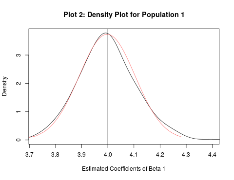

#### Instructor: Tomas Repasky
#### Group Members: 
- Johannes Wagner  
Humboldt-Universität Berlin - ID 598797 - Msc Statistics  
<wagnejoh@hu-berlin.de>
- Malgorzata Paulina Olesiewicz  
Humboldt-Universität Berlin - ID 598939 - Msc Statistics  
<malgorzata.paulina.olesiewicz@student.hu-berlin.de>

- Kevin Hoppe  
Humboldt-Universität Berlin - ID 598247 -  Msc Statistics  
<Kevin.Hoppe1@web.de>  

## Approximate individual contributions: 
```{r, echo = FALSE}
suppressWarnings(library("kableExtra"))

a=c("1.a",
    "1.b",
    "1.b i)",
    "1.b ii)", 
    "1.b iii)",
    "1.c",
    "1.c i)",
    "1.c ii)",
    "1.c iii)",
    "2.a", # 10
    "2.b",
    "2.c", # 12
    "2.d i)",
    "2.d ii)",
    "2.d iii)",
    "2.d iv)",
    "2.d v)")

b=c("70% progr. + 50% theory",
    "70% progr. + 70% theory",
    "70% progr. + 30% theory",
    "33% theory",
    "50% theory",
    "100% progr.",
    "40% theory",
    "100% theory",
    "50% theory",
    "-", # 2 a) 
    "-",
    "33% theory", # 2 c)
    "-",
    "30% theory",
    "-", # 2 d) iii
    "30% theory",
    "33% theory") 

c= c("-", 
     "-",
     "40% theory",
     "33% theory",
     "-", 
     "-",
     "50% theory",
     "-",
     "50% theory",
     "50% theory + 50% progr. ", # 2 a)
     "70% theory", # 2 b)
     "33% theory + 50% progr.", # 2 c)
     "40% progr.", # 2 d) i
     "40% theory",
     "60% theory ", # 2 d) iii
     "40% theory + 70% progr.",
     "33% theory") 
 
d= c("30% progr. + 50% theory", 
     "30% progr. + 30% theory",
     "30% progr. + 30% theory",
     "33% theory", 
     "50% theory", # 1 b) iii
     "-", # 1 c)
     "10% theory", # 1 c) i
     "-", # 1 c) ii
     "-", # 1 c) iii
     "50% theory + 50% progr.", # 2 a) 
     "30% theory", 
     "33% theory + 50% progr.", # 2 c)
     "60% progr.", # 2 d) i
     "30% theory", # 2 d) ii
     "40% theory", # 2 d) iii
     "30% theory + 30% progr.", # 2 d) iv
     "33% theory") # 2 d) v

work = data.frame(a,b,c,d)
colnames(work)= c("Task","Johannes","Malgorzata","Kevin")
kable(work)%>% kable_styling() 
```


$$
\pagebreak
$$

## First Problem: (Simulation: Latent Variable, Probit Model):

<!-- with  -->

<!-- $$ -->
<!-- \begin{array} { l }  -->
<!-- { \beta _ { 0 } = - 30 } \\ { \beta _ { 1 } = 4 } \\ -->
<!-- \\ -->
<!-- { Y _ { j } ^ { * } = \beta _ { 0 } + \beta _ { 1 } * X _ { 1 } + \varepsilon _ { j }} \\ -->
<!-- \\ -->
<!-- Y _ { j } = \left\{ \begin{array} { l l } { 1 \text { if } Y _ { j } ^ { * } > 0 } \\ { 0 , \text { otherwise } } \end{array} \right.\\ -->
<!-- \\ -->
<!-- j \in \{ 1,2,3 \} -->
<!-- \end{array} -->
<!-- $$ -->

## a) [1P] 

```{r include=FALSE}
library(tidyverse, quietly = TRUE) # for pipe operator %>%
library(mvtnorm, quietly = TRUE) # for joint multivariate Distribution
library(mfx, quietly = TRUE) # for estimating AMPE
library(foreign, quietly = TRUE)
library(margins, quietly = TRUE)
library(texreg, quietly = TRUE) # for printing the probit model
```


```{r, echo=FALSE}
# Assigment 1 ------------------------------------------------------------------
# Define Directory

#dir <- "~/R/git/Micro_Ass1/Markdown"
#setwd(dir)

setwd("C:/Users/Nutzer/Desktop")

# clear environment
rm(list = ls())

# set seed for comparibility
set.seed(101)
# ------------------------------------------------------------------------------
## Define Parameters for the latent model
beta0 <- -30
beta1 <- 4
# Number of Observations 30.000
obs = 30000

# Simulate given Distributions -------------------------------------------------

# Use package mvnorm for simulating multivariate Data with given vetcor of means
# and given Covariance Matrix V
# method used described by Ripley (1987, p.98)

## Define Covariance Matrix V for Population j = 1,2,3
V1 <- matrix(c(4,0,0,1), nrow=2, ncol=2)
V2 <- matrix(c(4,0,0,4), nrow=2, ncol=2)
V3 <- matrix(c(4,3,3,4), nrow=2, ncol=2)

# 1.a) Simulate three Datasets with Y, xNull and error -------------------

## Simulate distributions with given means and Covariance; round xNull 
distr1 <- rmvnorm(obs, mean = c(10,0) ,sigma = V1 , method = 'eigen') %>% as.data.frame() 
names(distr1) = c('xNull','error1')
distr1$xNull <- round(distr1$xNull,2)
distr2 <- rmvnorm(obs, mean = c(10,0) ,sigma = V2 , method = 'eigen') %>% as.data.frame()
names(distr2) = c('xNull','error2')
distr2$xNull <- round(distr2$xNull,2)
distr3 <- rmvnorm(obs, mean = c(10,0) ,sigma = V3 , method = 'eigen') %>% as.data.frame()
names(distr3) = c('xNull','error3')
distr3$xNull <- round(distr3$xNull,2)

# Latent Model for the joint multivariate Distributions
yLatent1 <- beta0 + beta1 * distr1[,"xNull"] + distr1[,"error1"]
yLatent2 <- beta0 + beta1 * distr2[,"xNull"] + distr2[,"error2"]
yLatent3 <- beta0 + beta1 * distr3[,"xNull"] + distr3[,"error3"]
## transform Latent Variable into Bernoulli Variable
y1 <- yLatent1 %>% replace(yLatent1<=0,0) %>% replace(yLatent1>0,1)
y2 <- yLatent2 %>% replace(yLatent2<=0,0) %>% replace(yLatent2>0,1)
y3 <- yLatent3 %>% replace(yLatent3<=0,0) %>% replace(yLatent3>0,1)
distr1 <- distr1 %>% mutate(Y = y1)
distr2 <- distr2 %>% mutate(Y = y2)
distr3 <- distr3 %>% mutate(Y = y3)
```

```{r include=FALSE}
# 1.a) Save the estimate for Betaj, j = 1,2,3 -----------------------------

# Probit Model
probit1<-glm(distr1[,"Y"] ~ distr1[,"xNull"], family=binomial(link="probit")) 
probit2<-glm(distr2[,"Y"] ~ distr2[,"xNull"], family=binomial(link="probit")) 
probit3<-glm(distr3[,"Y"] ~ distr3[,"xNull"], family=binomial(link="probit")) 
```

```{r, echo=FALSE}
estBeta1 <- round(probit1$coefficients[2], 2)
estBeta2 <- round(probit2$coefficients[2], 2)
estBeta3 <- round(probit3$coefficients[2], 2)
```


The estimates for $\hat { \beta } _ { 1,1 } , \hat { \beta } _ { 1,2 } \text{ and } \hat { \beta } _ { 1,3 }$ are `r estBeta1`, `r estBeta2` and `r estBeta3` respectively.

## b) [1.5P] 

```{r, echo=FALSE}
# b.) Repeat estimation 400 times -----------------------------------------
## Number of repeated iterations n
n <- 400
# empty vectors for estimated betas for each population
betaEst1 <- NULL
betaEst2 <- NULL
betaEst3 <- NULL
```

```{r include=FALSE}
for (i in 1:n){
  ## Population 1
  distr1 <- rmvnorm(obs, mean = c(10,0) ,sigma = V1 , method = 'eigen') %>% as.data.frame()
  names(distr1) = c('xOne','error1')
  distr1$xOne <- round(distr1$xOne,2)
  yLatent1 <- beta0 + beta1 * distr1[,"xOne"] + distr1[,"error1"]
  y1 <- yLatent1 %>% replace(yLatent1<=0,0) %>% replace(yLatent1>0,1)
  distr1 <- distr1 %>% mutate(Y = y1)
  probit1<-glm(distr1[,"Y"] ~ distr1[,"xOne"], family=binomial(link="probit"))
  betaEst1[i] <- probit1$coefficients[2]
  ## Population 2
  distr2 <- rmvnorm(obs, mean = c(10,0) ,sigma = V2 , method = 'eigen') %>% as.data.frame()
  names(distr2) = c('xOne','error2')
  distr2$xOne <- round(distr2$xOne,2)
  yLatent2 <- beta0 + beta1 * distr2[,"xOne"] + distr2[,"error2"]
  y2 <- yLatent2 %>% replace(yLatent2<=0,0) %>% replace(yLatent2>0,1)
  distr2 <- distr2 %>% mutate(Y = y2)
  probit2<-glm(distr2[,"Y"] ~ distr2[,"xOne"], family=binomial(link="probit"))
  betaEst2[i] <- probit2$coefficients[2]
  ## Population 3
  distr3 <- rmvnorm(obs, mean = c(10,0) ,sigma = V3 , method = 'eigen') %>% as.data.frame()
  names(distr3) = c('xOne','error3')
  distr3$xOne <- round(distr3$xOne,2)
  yLatent3 <- beta0 + beta1 * distr3[,"xOne"] + distr3[,"error3"]
  y3 <- yLatent3 %>% replace(yLatent3<=0,0) %>% replace(yLatent3>0,1)
  distr3 <- distr3 %>% mutate(Y = y3)
  probit3<-glm(distr3[,"Y"] ~ distr3[,"xOne"], family=binomial(link="probit"))
  betaEst3[i] <- probit3$coefficients[2]
}

## Make Plots for the answers
# Plot the kernel density estimates for beta based on the three populations ----
denBeta1 <- density(betaEst1, bw = "nrd0", adjust = 1.5, kernel = "gaussian")
denBeta2 <- density(betaEst2, bw = "nrd0", adjust = 1.5, kernel = "gaussian")
denBeta3 <- density(betaEst3, bw = "nrd0", adjust = 1.5, kernel = "gaussian")

png(filename="Plot2.png", height = 370)

plot(denBeta1$x,denBeta1$y,type="l",xlim = c(min(betaEst1) ,max(betaEst1)),
     xlab = "Estimated Coefficients of Beta 1", ylab = "Density", main ="Plot 2: Density Plot for Population 1")
rv <- rnorm(n, mean=mean(betaEst1),sd=sd(betaEst1)) %>% sort()
y <- dnorm(rv, mean=mean(betaEst1), sd=sd(betaEst1))
lines(rv, y, col = "indianred1")
abline(v=mean(betaEst1))
dev.off()


png(filename="Plot1.png")

plot(denBeta1$x,denBeta1$y,type="l",xlim = c(1.85 ,4.4), ylim = c(0, 13),
     xlab = "Estimated Coefficients", ylab = "Density", main ="Plot 1: Density Plot of Estimates of Beta 1")
lines(denBeta2$x,denBeta2$y, lty = 2)
lines(denBeta3$x,denBeta3$y, lty = 3)
legend("topright", legend=c("Population 1", "Population 2", "Population 3"), lty=1:3)
dev.off()

```

```{r, echo=FALSE}
knitr::include_graphics('Plot1.png')
```


In order to interpret our distributions, we need to find a smooth representation for the probability density functions of our estimates. We can make use of a kernel estimator 

$$
\hat { f } _ { h } ( x ) = \frac { 1 } { n } \sum _ { i = 1 } ^ { n } K _ { h } \left( x - x _ { i } \right) = \frac { 1 } { n h } \sum _ { i = 1 } ^ { n } K \left( \frac { x - x _ { i } } { h } \right)
$$
where we choose *K* to be a *Gaussian Kernel*, which is the convential choice and weighs observations $x_i$ using a standard normal density function centered around x. That means that $K ( \frac{x - x_i}{h}) = \phi ( \frac{x - x_i}{h} )$, where $\phi$ is the probability density function of the standard normal distribution. 
The smoothing parameter  *h*  is the bandwidth. It is chosen to be as small as possible to avoid loss of information and as big as necessary to avoid overfitting. Otherwise, the resulting density function does not represent the true density function of our estimates but instead the idiosyncrasies of the sample. We used "Silvermann's *rule of thumb*" for the bandwidth (see ?density in R). It is the default setting and can be adjusted using a multiplicative parameter. We decided to increase the bandwith by the factor 1.5 to get a more stable and informative distribution as with smaller values especially the distribution for population 1 appeared to be unstable.

## i.) [1.5P] 

```{r, echo=FALSE}

```

Given the basic properties of an ML-estimator under regularity conditions, we expect our estimates $\hat { \beta } _ {1,1}$ to be consistent and asymptotically normally distributed.

Given our large sample, we expect the estimator to converge in probability to the true parameter ${ \beta } _ {1,1}$. In our probit model we assume a) the independence of errors and regressors and b) an error variance of one. We know from the parameters we input in the data generating model for the first population that these assumptions hold. We therefore expect to (on average) estimate the true input parameter ${ \beta } _ {1,1} = 4$.

The plotted density confirms our expectation. We see that the plotted density of the estimates (black line in plot 2) approximately follows a normal distribution (indicated in red).

The estimates $\hat { \beta } _ {1}$ for our first population are concentrated around their expected value of 4, which is equivalent to the true parameter ${ \beta } _ { 1 }$ in our latent model. 

## ii.) [1P] 

As we can see in plot 1, all 3 distributions are approximately normal, but differ in their means and variances. For the means we find that ${\hat { E }(\hat \beta } _ { 1,1 })$ = `r round(mean(betaEst1),3)`, ${\hat { E }(\hat \beta } _ { 1,2 })$ = `r round(mean(betaEst2),3)` and ${\hat { E }(\hat \beta } _ { 1,3 })$ = `r round(mean(betaEst3),3)`. 

Given the assumptions stated in i), we expect the estimate of ${\hat \beta } _ { 1,1 }$ to be close to the true value of 4, as is the case. 
In the second population, the error variance is greater than one which results in a decreased estimate of ${\hat \beta } _ { 1,2 }$ since the estimate is derived as being equal to ${\beta / \sigma}$ with $\sigma$ being the standard deviation of the error term (see iii) ).

In the third population, there is covariance between the explanatory variable and the error term in the latent model. Therefore, the error term is not independent of the explanatory variable in our latent model as required in a.). In this case, it does not make much sense to compare the estimates from population three to the other ones, since the probit estimator can not be derived as being equal to ${\beta / \sigma}$ anymore. 

## iii.) [1P] 

The observed mean of the parameter estimates for population 2 is ${\hat { E }(\hat \beta } _ { 1,2 })$ = `r round(mean(betaEst2),3)`. 

We know that in the Probit model the coefficients for the regressors are consistently estimated at the true value $\beta$ standardized by the standard deviation of the error term. This means, the estimated parameter is on average equal to ${\beta / \sigma}$ rather than just $\beta$. As long as the error term in the latent model is normalized to be one, as is usually assumed, this does not change the estimate. But in population 2, we specificially set the standard deviation of the error term to two. We therefore expect the estimates for this population to be centered around $\hat { \beta } _ { 1,2 } = \beta _ { j } / \sigma = 4 / 2 = 2$. This can also be seen in the respective plot.  


```{r include=FALSE}
## create empty vectors for our estimates
AMPEEst1 <- NULL
AMPEEst2 <- NULL
AMPEEst3 <- NULL


for (i in 1:n){
  ## Population 1
  distr1 <- rmvnorm(obs, mean = c(10,0) ,sigma = V1 , method = 'eigen') %>% as.data.frame()
  names(distr1) = c('xOne','error1')
  distr1$xOne <- round(distr1$xOne,2)
  yLatent1 <- beta0 + beta1 * distr1[,"xOne"] + distr1[,"error1"]
  y1 <- yLatent1 %>% replace(yLatent1<=0,0) %>% replace(yLatent1>0,1)
  distr1 <- distr1 %>% mutate(Y = y1)
  probitAMPE1 <- probitmfx(Y~xOne,data=distr1,atmean=FALSE)
  AMPEEst1[i] <- probitAMPE1$mfxest[1]
  ## Population 2
  distr2 <- rmvnorm(obs, mean = c(10,0) ,sigma = V2 , method = 'eigen') %>% as.data.frame()
  names(distr2) = c('xOne','error2')
  distr2$xOne <- round(distr2$xOne,2)
  yLatent2 <- beta0 + beta1 * distr2[,"xOne"] + distr2[,"error2"]
  y2 <- yLatent2 %>% replace(yLatent2<=0,0) %>% replace(yLatent2>0,1)
  distr2 <- distr2 %>% mutate(Y = y2)
  probitAMPE2 <- probitmfx(Y~xOne,data=distr2,atmean=FALSE)
  AMPEEst2[i] <- probitAMPE2$mfxest[1]
  ## Population 3
  distr3 <- rmvnorm(obs, mean = c(10,0) ,sigma = V3 , method = 'eigen') %>% as.data.frame()
  names(distr3) = c('xOne','error3')
  distr3$xOne <- round(distr3$xOne,2)
  yLatent3 <- beta0 + beta1 * distr3[,"xOne"] + distr3[,"error3"]
  y3 <- yLatent3 %>% replace(yLatent3<=0,0) %>% replace(yLatent3>0,1)
  distr3 <- distr3 %>% mutate(Y = y3)
  probitAMPE3 <- probitmfx(Y~xOne,data=distr3,atmean=FALSE)
  AMPEEst3[i] <- probitAMPE3$mfxest[1]
}

# c) Plot the kernel density estimates ------------------------------------

# adjust broder bandwidth to get a smooth function
denAMPE1 <- density(AMPEEst1, bw = "nrd0", adjust = 2, kernel = "gaussian")
denAMPE2 <- density(AMPEEst2, bw = "nrd0", adjust = 2, kernel = "gaussian")
denAMPE3 <- density(AMPEEst3, bw = "nrd0", adjust = 2, kernel = "gaussian")

## Make one Plot
png(filename="Plot3.png")

plot(denAMPE1$x,denAMPE1$y,type="l",xlim = c(min(AMPEEst1),max(AMPEEst3)), ylim = c(0, 300),
     xlab = "Estimated Coefficients", ylab = "Density", main ="Plot 3: Density Plot of AMPES")
lines(denAMPE2$x,denAMPE2$y, lty = 2)
lines(denAMPE3$x,denAMPE3$y, lty = 3)
legend("topright", legend=c("Population 1", "Population 2", "Population 3"), lty=1:3)

clip(0,0.120,0,max(denAMPE1$y))
abline(v=mean(AMPEEst1))
clip(0,0.120,0,max(denAMPE2$y))
abline(v=mean(AMPEEst2))
clip(0,0.120,0,max(denAMPE3$y))
abline(v=mean(AMPEEst3))
dev.off()


```


## c.) [1P]

```{r, echo=FALSE}

```

Again we can see that the sample distributions are approximately normal and centered around their means. We get `r round(mean(AMPEEst1),3)`, `r round(mean(AMPEEst2),3)` and  `r round(mean(AMPEEst3),3)` for $\hat { E } [ A M P E | j ]$ given the populations j = 1,2 and 3.


## i.) [1.5P] 


```{r, echo=FALSE}
relDiff1 <- round(abs((mean(AMPEEst1) - mean(AMPEEst3)) / mean(AMPEEst3)*100),2)
```
We calculate the relative difference:
$$
\text{relative difference} = \left| \frac { x - y } { max ( x , y ) } \right| \cdot 100 \%
$$

The relative difference between $\hat { E } [ A M P E | j = 1 ]$ and  $\hat { E } [ A M P E | j = 3 ]$ is `r relDiff1` percent.

In this case, the estimate of $\hat { E } [ A M P E | j = 1 ]$ is more reliable, since in population 1 a) the error term is independent of the regressor $X _ { 1 }$ and b) the error term is standard normally distributed. In population 3 on the other hand, these conditions are not met and the assumptions made in the estimation of our Probit model are therefore violated.

## ii.) [0.5P]

```{r, echo=FALSE}
relDiff2 <- round(abs((mean(AMPEEst1) - mean(AMPEEst2)) / mean(AMPEEst2)*100),2)
```

The relative difference between $\hat { E } [ A M P E | j = 1 ]$ and $\hat { E } [ A M P E | j = 2 ]$ is `r relDiff2` percent.

## iii.) [3P]

Taking into account that the AMPE depends on the value of $\hat { \beta }_1$, the results in c-i) and c-ii) are not intuitive, since in plot 1 $\hat { \beta }_1$ population 1 and 3 are much closer to each other and the distribution of the $\hat { \beta }_{1,2}$ is further away.

However, since we know that in case of population 2 - where the error term is not standard normally distributed but still independent of ${X_1}$ - the attentuation bias due to ${\beta / \sigma}$ will average out across its distribution in the AMPE estimation. Since both our AMPE estimators of populations 1 and 2 are consistent, we expect the AMPE estimates to approximately center around the same value and their relative difference to be very small (c-ii). In plot 3 we can see that both distributions are in fact close with $\hat { E } \hat{[ A M P E }| j = 2 ]$ being slightly larger than $\hat { E } [ A M P E | j = 1 ]$. Since the variance of the error term in population j = 2 is greater than one, there is neglected heterogeneity here which adds an unknown constant to our partial effects in the probit.

In population 3 we also deal with unobserved heterogenity with the variance of the error term being greater than one. However, here the error term is correlated with ${X_1}$ and the latent variable is clearly heteroscedastic over the range of the explanatory variable. In this case, it is not possible to consistently estimate $\hat { \beta } _ { 1,3 }$ and $\hat { E } [\hat{ A M P E }| j = 3 ]$. The violation of our model assumptions explain the relatively big discrepancy between $\hat { E } [\hat{ A M P E }| j = 1 ]$ and $\hat { E } [ \hat{ A M P E }| j = 3 ]$. This can be observed in Plot 3 and results in the relative big difference calculated in c)i. 


$$
\pagebreak
$$

## Problem 2: (Marginal effects estimation & Interpretation):

## a.) [0.5P] 


```{r, echo=FALSE}
# Define Directory

#dir <- "~/R/git/Micro_Ass1"
#setwd(dir)

data <- read.dta(file= "south_african_heart_disease_data.dta") 
## Estimating effect ch ~ ldl

probit<-glm(data$chd~data$ldl,family=binomial(link="probit"))

```

In non-linear regression models such as the probit model, coefficients cannot be directly interpreted as marginal effects.
The coefficients give only the direction of the marginal effect of each regressor ${X_i}$ on the response probability (as indicated by their sign), and we can test for the significance level of the coefficients. Therefore, we can tell from the obtained coefficients that ldl-cholesterol increases the probability of suffering from heart disease and is significantly different from zero in this sample.


## b.) [0.5P] 

Since Y is a Bernoulli random variable, its variance depends on $\mathrm { P } \left( y _ { i } = 1 | \mathbf { x } _ { i } \right)$, which in general is a function of regressor ${X}_i$ so that Y is heteroskedastic. 
Therefore, in the maximum likelihood estimation of coefficient $\hat { \beta }_1$ which incorporates the Bernoulli pdf, the heteroskedasticity in Var(y|x) is automatically accounted for and there is no need to further test for it. The estimated standard errors are valid and can be used to conduct the asymptotic t-test and to construct confidence intervals. 

## c.) [2P]


```{r, echo=FALSE}
probit2<-glm(data$chd~data$ldl+data$age,family=binomial(link="probit"))

correlation_ldl_age <- cor.test(data$ldl, data$age)
resultCor <-as.numeric(correlation_ldl_age[4]) %>% round(2)
```

In the extended model, the coefficients are estimated under the ceteris paribus assumption (all else being equal), meaning that while estimating each of them we control for the effect of all other predictors in the model.
If both variables were independent, the coefficient of *ldl* should not change in the second model when controling for *age*. Therefore, seeing that the coefficient for *ldl* has changed compared to the estimated model without *age*, we may suspect that *ldl* and *age* are not independent. This is plausible: older people in the sample may tend to have higher levels of cholesterol. In the data there is a linear correlation between ldl and age equal to `r resultCor`
As expected, *ldl* and *age* are not independent and both are related to heart disease. In the first model, the *ldl* coefficient captured some of the effect of *age* on heart disease. When explicitly entering *age* as a regressor, this part of the variance in *ldl* is removed when estimating its regression coefficient. 

## d. i.) [1P] 

```{r, echo=FALSE}
probit3<-glm(data$chd~poly(data$ldl,2, raw= TRUE),family=binomial(link="probit"))
```

```{r, echo=FALSE}

## Extract regression coefficients:

beta.1 <- as.numeric(probit$coefficients)
beta.2 <- as.numeric(probit3$coefficients)

## Prepare design matrices:

ldl <- seq(1, 15, 0.01)
ldl.square <- ldl^2
int <- rep(1, length(ldl))

designmat.1 <- as.matrix(data.frame("intercept" = int, 
                                    "ldl" = ldl))

designmat.2 <- as.matrix(data.frame("intercept" = int, 
                                    "ldl" = ldl, 
                                    "ldl.square" = ldl.square))

## Calculate linear predictor:

xb1 <- designmat.1 %*% beta.1
xb2 <- designmat.2 %*% beta.2

## Calculate marginal probability effect for each probit model:

mpe1 <- dnorm(xb1)*beta.1[2]
mpe2 <- dnorm(xb2)*(beta.2[2] + 2*beta.2[3]*ldl)
```

```{r, include=FALSE}
## Plot them together:
png(filename="Plot4.png", height = 350)

plot(x = ldl, 
     y = mpe1, 
     t= "l", 
     col="red", 
     lwd=2, 
     xlim=c(1,15),
     ylim=c(min(mpe1, mpe2), max(mpe1, mpe2)),
     main = "Plot 4: MPE for ldl in two probit models",
     ylab = "MPE")

lines(x = ldl, y = mpe2, t= "l", col="blue", lwd=2)
abline(v=mean(data$ldl))

legend("right", legend = c("ldl", "ldl + ldl²"), fill=c("red", "blue"))
dev.off()
```

```{r, echo=FALSE}
knitr::include_graphics('Plot4.png')
```

## ii.) [0.5P] 

In the probit model, the MPE is given using the non-linear standard normal pdf to transform a linear combination of data weighted by the regression coefficients. Therefore, none of the MPE is linear. An increase in *ldl* by one unit leads to an incremental change in the probability by $\phi ( \mathbf { x' } \boldsymbol { \beta } ) \left( \beta _ { 1 } \right)$.
The value of the MPE with respect to regressor $X_1$ also depends on the value of all other regressors and is different for every observation.


## iii.) [1P] 

Adding $ldl^2$ variable allows us to estimate whether the marginal effect of *ldl* on the probability increases or decreases according to the value of *ldl*, as opposed to model a) where we assume strict monotonicity of the effect of ldl on the marginal probability.
In model d), the marginal effect of $ldl^2$  has a negative coefficient, which tells us that the marginal probability function of $P(Y=1|ldl)$ is concave and will reach its maximum when $\frac { d P } { d \operatorname { ldl } } = 0$.

Interpretation: Until a certain level (in our case ~ 11; see plot 4) an increase of *ldl* is associated with an increased chance of heart disease. Above that level, the marginal probability effect of *ldl* in model d.) is negative. From that point on, even higher levels of *ldl* are associated with decreasing chances of heart disease. This would not be possible in model a), where the marginal effects are monotonous. 

## iv.) [1.5P] 

```{r, echo=FALSE}
mean_ldl= mean(data$ldl)

# calculate MPEs
mpe1_mean <- dnorm(beta.1[1]+ beta.1[2]*mean_ldl)*(beta.1[2])
mpe2_mean <- dnorm(beta.2[1]+ beta.2[2]*mean_ldl+beta.2[3]*mean_ldl^2)*(beta.2[2] + 2*beta.2[3]*mean_ldl)

# get model parameters
Probit_at_ldl_mean1 <- probitmfx(data$chd~data$ldl,data=data,atmean=TRUE)
Probit_at_ldl_mean2 <- probitmfx(data$chd~data$ldl+I(data$ldl^2),data=data,atmean=TRUE)
```
In model a), $\frac { d P } { d \operatorname { ldl } }$ of *ldl* at its mean equals `r round(mpe1_mean,4)`.

Interpretation: This marginal probability effect suggest that for a (possibly imaginary) individual with the exact mean characteristics of the sample an increase of their ldl-cholesterol by one unit increases their chances of heart disease by 6.09 percentage points.

In model d), $\frac { d P } { d \operatorname { ldl } }$ of *ldl* at its mean equals `r round(mpe2_mean,4)`.

Interpretation: For an individual with the exact mean characteristics, an increase of their ldl-cholesterol by one unit increases their probability of getting the heart disease by 8.08 percentage points.


## v.) [1P]

No, none of the computed effects in iv) are ceteris paribus since we have only one regressor variable ldl.
In the model from d), once we fix the value of *ldl* at its mean, the value of $ldl^2$ is also automatically fixed at $(mean(ldl))^2$. This means that once we fix the value of *ldl* at its mean, there are no other variables that we need to control for - there can be no in the outcome caused by another variable. Furthermore, if there were other regressors, they still would not be ceteris paribus effects since the MPE depends on each individual's values on all other regressors and therefore may be different for every observation (see ii) ).